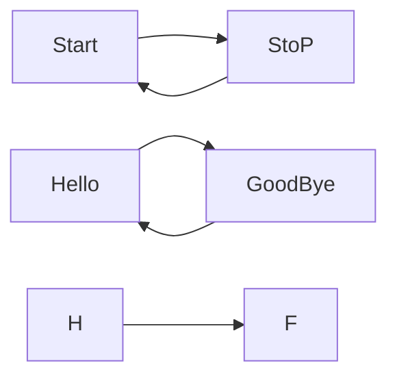

# TEST 
<!-- generated by mermaid compile action - START -->

  
Mermaid markup

```mermaid
flowchart LR
    Start --> StoP
    StoP --> Start
    Hello --> GoodBye
    GoodBye --> Hello
    H --> F
    
```

<!-- generated by mermaid compile action - END -->
